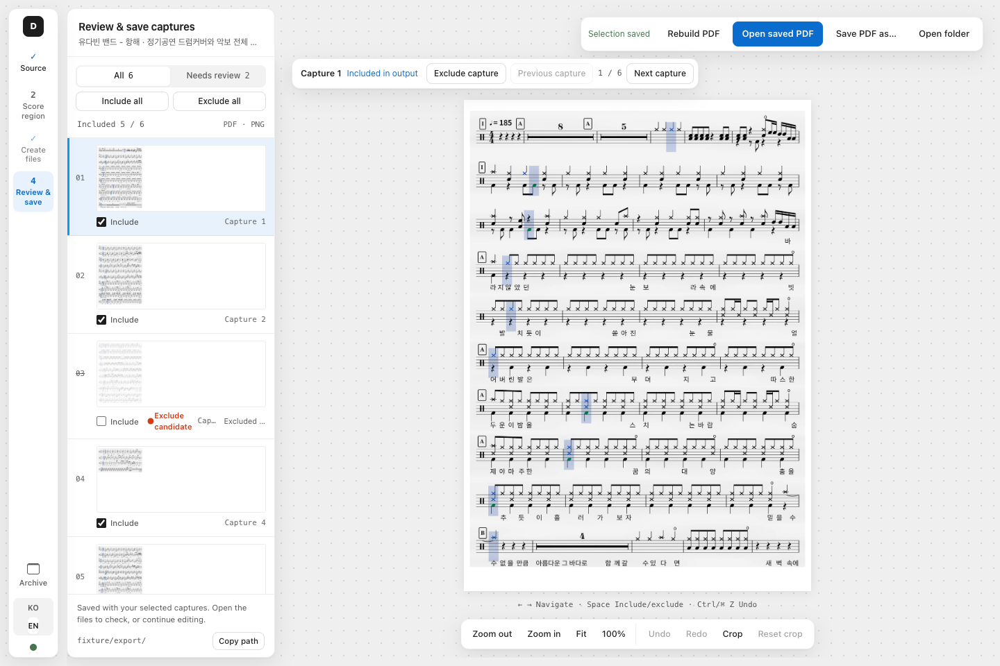

# Drum Sheet Capture User Guide

Capture score regions shown in a video and save them as PNG, JPG, or PDF. This app captures images; it does not transcribe audio into notation or export MusicXML/MIDI.

[Download the latest release](https://github.com/kr-ericshim/drum-score-capture-tool/releases/latest) · [한국어 · Project home](./README.md) · [한국어](./README.ko.md)

This guide follows the development source after v0.1.33. Unreleased features may differ from your installed version; check its release notes.

[Installation](#installation) · [Basic workflow](#basic-workflow) · [Troubleshooting](#troubleshooting)



*Renderer preview using sample data. Your installed version may look different.*

## Installation

| Computer | Download |
| --- | --- |
| Windows x64 — Intel/AMD 64-bit | `.exe` installer |
| macOS Apple Silicon — M-series | `arm64.dmg` |

Python, Node.js, and FFmpeg do not need to be installed separately. Intel Mac, native Windows ARM64, and Linux installers are not currently provided.

### Windows

1. Open the release page above and download the `.exe` under **Assets**. The source code ZIP is not an installer.
2. Run the installer and open the app.
3. The current build is unsigned, so SmartScreen may show a warning. After confirming the file came from this repository, use **More info → Run anyway** if offered. Managed computers may enforce a different policy.

### macOS

1. Download `arm64.dmg` from **Assets**.
2. Open it and copy the app to `Applications`.
3. Launch the copied app.

Starting with v0.1.34, macOS builds use a free ad-hoc signature. They are not Developer ID signed or notarized, so macOS may block the first launch. After verifying the download came from this repository, use **System Settings → Privacy & Security → Open Anyway**. Managed Macs may restrict this option.

Only if that option is unavailable, remove quarantine from the trusted installed app and reopen it. This does not repair an invalid signature:

```bash
xattr -dr com.apple.quarantine "/Applications/Drum Sheet Capture.app"
```

If “damaged” persists, download the latest installer or report the issue instead of disabling system-wide security. v0.1.33 has a separate signature validation defect.

## Basic workflow

1. **Import a video:** select a local file or prepare a public YouTube URL.
2. **Select the score area:** load a clear frame and check the suggested capture region (ROI), or draw it manually when no suggestion is available. Suggestions are editable drafts; choose **Apply region** to confirm. Leave enough room for notes, lyrics, and repeat markings.
3. **Run the capture:** choose PDF, PNG, JPG, or a combination. In versions with **Capture range**, enter **Start** and **End** as seconds (`90`) or minutes:seconds (`1:30`). Leave both empty for the whole video. Range fields were added in the v0.1.33 source; older versions process the whole video. For PDF, enter the required title before starting.
4. **Review the results:** inspect pages, select the captures to keep, and crop margins if needed. After changing the selection or crops, use **Rebuild PDF** or **Rebuild images** to update the output. Existing files do not change until you rebuild them.
5. **Save the files:** check the PNG, JPG, or PDF output. Use **Save PDF as…** to save a PDF copy to your preferred location.

A saved language preference takes priority. Otherwise, Korean system locales start in Korean and other locales start in English.

## Input and storage

- Video processing runs locally. YouTube import requires an internet connection.
- The installed app checks GitHub for a new version at launch and when you press **Update** in the sidebar. It downloads only after you choose **Update**, verifies the file checksum, and installs when you choose **Restart to install**. On macOS, if the app runs from somewhere it cannot replace itself (inside the DMG or a read-only folder), it opens the installer window instead.
- **Report a problem** sends only when you press **Send**: what you wrote, plus the diagnostics and app screenshot if you keep them checked. Videos and generated files are never sent.
- Sign-in, age, or region restrictions and YouTube service changes can prevent imports. You can also use a local video file.
- The file picker accepts MP4, MKV, MOV, AVI, and WEBM. A supported extension does not guarantee that every codec or damaged file can be read.
- Working videos, frames, and results can use much more disk space than the installer. Save important PDFs to a separate folder.
- Installed builds store working data in a `jobs` directory under the app's user data folder. Development runs use `backend/jobs`.

## Clear app storage

Open **Archive → Clear cache**, read the confirmation, then choose **Delete all**. This screen was added after v0.1.33 and is not in that installer. It deletes captures, generated PDFs/images, downloaded YouTube videos and history stored inside the app's working folder. Original local videos and files copied outside that folder remain. Save important results elsewhere first; deletion cannot be undone. Clearing is disabled while work is running.

## Troubleshooting

| Symptom | What to check |
| --- | --- |
| Backend connection failed | Fully quit and reopen the app. Confirm the installer matches your OS architecture. If it persists, record the error and app version. |
| YouTube import failed | Check that the link is public and inspect the preparation details. Try local video input as well. |
| Blurry or incorrect preview | Seek to a frame where the score is still and clear, then reload it. |
| Notes or page edges are clipped | Adjust the ROI in the original frame and capture again. Zoom into the PDF to check markings above and below the staff. |
| Unexpected result pages | Check missing, duplicate, or suspicious captures in review, then export the final selection again. |

Report unresolved issues in [Issues](https://github.com/kr-ericshim/drum-score-capture-tool/issues). Include app version, OS/CPU architecture, local or YouTube input, reproduction steps, and the error message. Remove private file paths and links from logs before sharing.

## Development and builds

For source setup and builds, see the [project README](./README.md#development). Maintainers should use the [release runbook](./docs/release/github-release-runbook.md).
