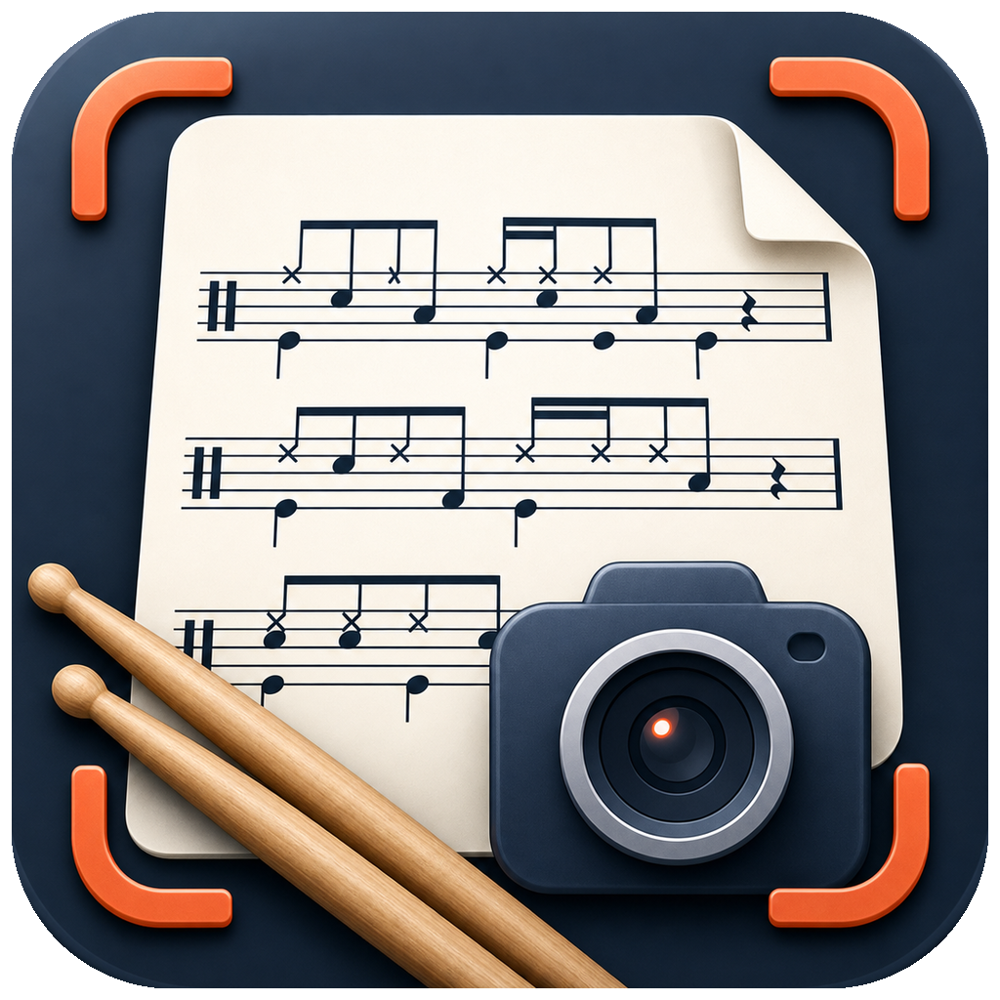
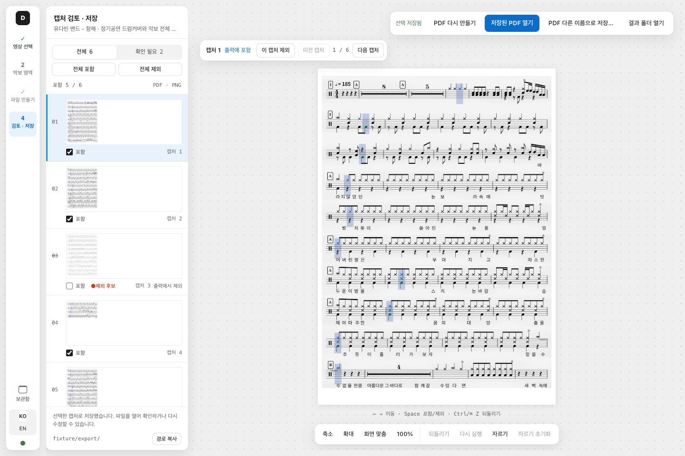

<p align="center">
  
</p>

<h1 align="center">Drum Sheet Capture</h1>

<p align="center">
  <strong>영상 속 악보를 모아, 연습할 때 펼쳐 볼 한 권의 PDF로.</strong><br>
  악보 영역을 정하고, 필요한 캡처를 골라 PNG · JPG · PDF로 저장하세요.
</p>

<p align="center">
  <a href="https://github.com/kr-ericshim/drum-score-capture-tool/releases/latest"><strong>설치 파일 다운로드</strong></a> ·
  <a href="#처음-사용하기">처음 사용하기</a> ·
  <a href="./README.ko.md">자세한 사용 가이드</a> ·
  <a href="./README.en.md">English</a>
</p>

<p align="center">
  <a href="https://github.com/kr-ericshim/drum-score-capture-tool/releases/latest"></a>
  <a href="./LICENSE"></a>
</p>



<p align="center"><sub>검토 · 저장 화면 예시 — 샘플 데이터를 사용한 앱 렌더러 화면입니다. 설치한 버전에 따라 화면이 다를 수 있습니다.</sub></p>

## 이런 작업에 쓸 수 있어요

- **영상에 나오는 악보 모으기** — 로컬 영상이나 공개 YouTube 영상에서 악보가 있는 영역을 캡처합니다.
- **필요한 페이지만 남기기** — 캡처를 크게 보면서 중복되거나 불필요한 이미지를 제외하고 여백을 자릅니다.
- **연습용 파일 만들기** — PDF로 묶거나 PNG·JPG로 저장합니다. PDF에는 제목, 연주자, BPM, 메모를 넣을 수 있습니다.

영상 처리는 내 컴퓨터에서 실행됩니다. **영상에 이미 표시된 악보를 이미지로 옮기는 앱**이며, 소리를 듣고 악보를 만드는 채보나 MusicXML·MIDI 변환 기능은 없습니다.

## 다운로드와 설치

[최신 버전 다운로드 페이지](https://github.com/kr-ericshim/drum-score-capture-tool/releases/latest)의 **Assets**에서 컴퓨터에 맞는 파일을 받으세요.

| 사용하는 컴퓨터 | 받을 파일 | 설치 방법 |
| --- | --- | --- |
| Windows · Intel/AMD 64비트 | `.exe` | 설치 파일을 실행한 뒤 앱을 엽니다. |
| Mac · Apple Silicon(M 시리즈) | `arm64.dmg` | DMG를 열고 앱을 **Applications(응용 프로그램)** 폴더로 옮깁니다. |

**Python, Node.js, FFmpeg를 따로 설치할 필요가 없습니다.** `Source code` ZIP은 설치 파일이 아닙니다. Intel Mac, Windows ARM64 전용, Linux 설치 파일은 현재 제공하지 않습니다.

> **설치 중 보안 경고가 나오나요?** 현재 배포 파일에는 코드 서명과 macOS 공증이 없습니다. 공식 저장소에서 받은 파일인지 확인한 뒤 [Windows 안내](./README.ko.md#windows) 또는 [macOS 안내](./README.ko.md#macos)를 따라 주세요.

## 처음 사용하기

**영상 선택 → 악보 영역 → 파일 만들기 → 검토 · 저장** 순서로 진행합니다.

### 1. 영상을 엽니다

**파일 열기**로 영상을 선택하거나 화면에 끌어 놓으세요. YouTube 영상은 주소를 붙여 넣고 **유튜브 영상 준비**를 누릅니다.

### 2. 악보가 있는 영역을 정합니다

악보가 선명하게 보이는 장면을 고른 뒤 자동 추천 영역을 확인합니다. 필요하면 직접 그리거나 모서리를 조절하고 **영역 적용**을 누르세요. 음표와 반복 기호가 잘리지 않도록 여유를 두면 좋습니다.

자동 추천은 수정할 수 있는 초안입니다. **영역 적용**을 눌러야 확정됩니다.

### 3. 파일을 만듭니다

**PDF 문서**, **PNG 묶음**, **JPG 묶음** 중 필요한 형식을 고릅니다. 여러 형식을 함께 선택할 수 있습니다. PDF를 선택했다면 제목과 문서 정보를 입력한 뒤 생성을 시작하세요.

캡처 구간 입력란이 있는 버전에서는 시작·종료 시각을 지정할 수 있습니다. 두 칸을 비워 두면 전체 영상을 처리합니다. [구간 설정과 출력 옵션](./README.ko.md#3-파일-만들기)에서 자세히 볼 수 있습니다.

### 4. 확인하고 저장합니다

캡처를 하나씩 보면서 **포함** 여부를 정하고, 필요하면 **자르기**로 여백을 줄이세요. 수정했다면 **PDF 다시 만들기** 또는 **이미지 다시 만들기**를 누릅니다.

PDF는 **PDF 다른 이름으로 저장…**으로 원하는 폴더에 보관하세요. PNG·JPG는 **결과 폴더 열기**에서 복사할 수 있습니다.

> 선택이나 자르기를 바꿔도 기존 출력 파일은 바로 바뀌지 않습니다. **다시 만들기**를 누른 뒤 새 결과를 확인하세요.

[전체 사용 가이드](./README.ko.md#사용법) · [단축키](./README.ko.md#단축키) · [보관함 사용법](./README.ko.md#저장한-pdf-다시-열기)

## 자주 묻는 질문

<details>
<summary><strong>YouTube 영상을 가져오지 못해요.</strong></summary>

공개 영상인지 확인하고 **세부 진행**의 오류를 살펴보세요. 로그인·연령·지역 제한이나 YouTube의 동작 변경으로 가져오기가 실패할 수 있습니다. 같은 영상을 로컬 파일로 갖고 있다면 **파일 열기**로 진행할 수 있습니다.

</details>

<details>
<summary><strong>악보가 흐리거나 일부가 잘려요.</strong></summary>

원본 영상에서 악보가 선명하게 보이는지 확인하세요. **악보 영역**에서 다른 시점의 프레임을 불러오거나 캡처 범위를 넓혀 다시 적용해 보세요. 이미 잘린 음표는 검토 화면의 자르기로 복구할 수 없습니다.

</details>

<details>
<summary><strong>파일은 어디에 저장되나요?</strong></summary>

앱이 관리하는 작업 폴더에 만들어집니다. **결과 폴더 열기**로 확인하고, 보관할 PDF는 **PDF 다른 이름으로 저장…**으로 별도 폴더에 복사하세요. **보관함**은 마지막에 만든 PDF를 찾는 기능이며 별도 백업은 아닙니다.

</details>

<details>
<summary><strong>인터넷 없이 쓸 수 있나요?</strong></summary>

로컬 영상의 캡처와 파일 생성은 컴퓨터에서 처리합니다. YouTube 영상을 가져올 때는 인터넷 연결이 필요합니다. 설치형 앱은 새 버전 확인을 위해 GitHub에 연결할 수도 있습니다.

</details>

다른 문제가 있다면 [문제 해결 가이드](./README.ko.md#문제-해결)를 확인하거나 [Issues에 알려 주세요](https://github.com/kr-ericshim/drum-score-capture-tool/issues). **앱 버전, 운영체제, 사용한 영상 종류, 문제가 생긴 순서, 오류 메시지**가 있으면 원인을 찾는 데 도움이 됩니다. 로그를 올리기 전 개인 파일 경로나 비공개 링크를 지워 주세요.

## 개발 안내

설치 파일로 사용하는 분은 이 부분을 건너뛰어도 됩니다. 문서는 현재 소스 기준이며, 아직 배포되지 않은 기능은 설치한 버전과 다를 수 있습니다. 배포된 기능은 [릴리스 노트](https://github.com/kr-ericshim/drum-score-capture-tool/releases)에서 확인하세요.

<a id="development"></a>
<details>
<summary><strong>소스로 실행하기 · 설치 파일 빌드하기</strong></summary>

개발 환경은 **Python 3.11**, **Node.js 22**를 사용합니다. 소스로 실행할 때는 `ffmpeg`와 `ffprobe`가 `PATH`에 있거나 `DRUMSHEET_FFMPEG_BIN` / `DRUMSHEET_FFPROBE_BIN`으로 지정되어 있어야 합니다.

저장소 루트에서 실행합니다. 기존 개발 환경이 있다면 먼저 확인하고 재사용하세요.

**macOS**

```bash
python3.11 -m venv backend/.venv
backend/.venv/bin/python -m pip install -r backend/requirements-build.lock
npm --prefix desktop ci
npm --prefix desktop start
```

**Windows PowerShell**

```powershell
py -3.11 -m venv backend/.venv
.\backend\.venv\Scripts\python.exe -m pip install -r backend/requirements-build.lock
npm --prefix desktop ci
npm --prefix desktop start
```

설치 파일은 대상 운영체제에서 빌드합니다. 먼저 `python3 scripts/media_bundle.py restore`(Windows는 `python`)로 검증된 FFmpeg·FFprobe 묶음을 준비하세요. [미디어 도구 안내](./docs/release/media-toolchain.md)에 자세한 절차가 있습니다. 현재 빌드는 고정된 소스와 설정으로 만든 미디어 도구를 검사하므로, 개발 실행용 FFmpeg만 설치한 상태에서는 패키징할 수 없습니다.

```bash
npm --prefix desktop run dist:release
npm --prefix desktop run smoke:packaged-electron
npm --prefix desktop run smoke:packaged-runtime
```

출력 위치는 `dist/`입니다. `pack:release`는 설치 파일 없이 앱 패키지만 만듭니다. 배포에는 `dist:release`와 [릴리스 절차](./docs/release/github-release-runbook.md)를 사용하세요. 선택 기능인 HAT 업스케일링 의존성은 일반 캡처·저장에 필요하지 않습니다.

| 경로 | 내용 |
| --- | --- |
| [`desktop/`](./desktop) | Electron 앱과 화면 |
| [`backend/`](./backend) | 로컬 영상 처리 엔진 |
| [릴리스 절차](./docs/release/github-release-runbook.md) | 빌드·검증·배포 순서 |
| [배포 점검표](./docs/release/final-production-checklist.md) | 공개 전 확인 항목 |

</details>

## 라이선스

프로젝트 소스는 [MIT 라이선스](./LICENSE)로 제공됩니다. 함께 배포되는 외부 구성 요소에는 각 구성 요소의 라이선스가 적용됩니다.
